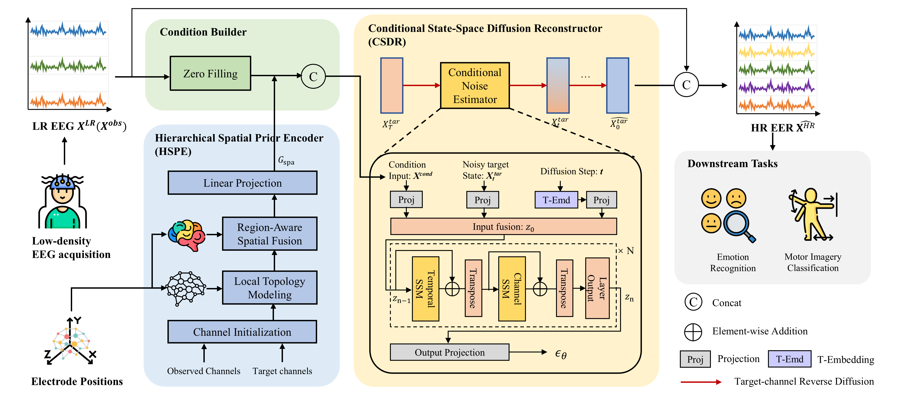

# TGSD
The official implementation of TGSD: Topology-Guided State-Space Diffusion Framework for EEG Spatial Super-Resolution

  <p align="center">
    <a href="[https://arxiv.org/abs/2412.17337](https://arxiv.org/abs/2502.21154)">
      
    </a>
  </p>

## Abstract
While low-density EEG is ideal for wearable and Internet of Things (IoT)-based brain sensing, its sparse electrode sampling often lacks the spatial resolution necessary to characterize cross-regional neural activity. EEG spatial super-resolution aims to recover dense-channel EEG from sparse recordings, yet remains challenging because channel missingness typically occurs at the whole-channel level, spatiotemporal dependencies across the electrode layout are underexplored, and the mapping from sparse to dense signals is inherently ill-posed. To address these issues, we propose TGSD, a topology-guided state-space diffusion framework for EEG spatial super-resolution. TGSD employs a Hierarchical Spatial Prior Encoder to learn topology-aware priors across the complete electrode layout by integrating local geometric relationships with region-level contextual information. Guided by these priors and sparse observations, a Conditional State-Space Diffusion Reconstructor progressively generates missing-channel signals through reverse diffusion, while alternating temporal and channel-wise state-space modeling captures long-range temporal dynamics and inter-channel dependencies in a unified framework. Experiments on the SEED and PhysioNet MM/I datasets show that TGSD consistently outperforms representative baselines across various super-resolution factors in both reconstruction fidelity and downstream classification performance. These results demonstrate the effectiveness of integrating topology-aware spatial priors with conditional diffusion to enhance practical low-density EEG sensing in wearable and IoT scenarios.

## Data availability

SEED: https://bcmi.sjtu.edu.cn/home/seed/seed.html
PhysioNet MM/I: https://www.physionet.org/content/eegmmidb/1.0.0/

## Setting Up Your Environment and Dependencies

To ensure a clean and consistent working environment for this project, please follow these steps:

**1. Create and Activate a New Conda Environment**

First, create a dedicated Conda environment specifically for this project. This helps isolate project dependencies and prevents version conflicts with other projects.

```bash
conda create -n TGSD python=3.8
```
Once the environment has been created, activate it using the following command:

```bash
conda activate TGSD
```

**2. Install Required Dependencies**

With the environment activated, install all necessary dependencies using the `requirements.txt` file provided with the project. This file contains a list of all Python packages and their specific versions required for the project to function correctly.

```bash
pip install -r requirements.txt
```

**3. Verify Installation**

After the installation process completes, it's advisable to verify that all dependencies have been installed correctly. You can do this by checking the list of installed packages or by attempting to import key modules in a Python shell.

Additionally, you may want to list all Conda environments to ensure the environment was created and activated properly:

```bash
conda info --envs
```

By following these steps, you'll have a properly configured environment with all necessary dependencies installed, ensuring the project runs smoothly.


